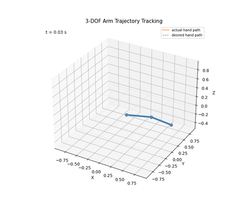

# RobotLink

**Symbolic derivation → C++ code generation → simulation → visualization** for a
3-DOF spatial robot arm.

RobotLink derives the full nonlinear equations of motion of a 3-degree-of-freedom
arm symbolically with [SymPy](https://www.sympy.org/), exports them as an
optimized C++ header, and runs a computed-torque-controlled simulation in C++
with [Eigen](https://eigen.tuxfamily.org/). Results are written to CSV and can be
inspected with an interactive Python visualizer.



---

## Why this project

Most teaching examples either (a) hand-code the dynamics — error-prone and hard
to extend — or (b) stay entirely in Python and never reach real-time-capable
code. RobotLink shows a complete pipeline instead:

1. **Derive** the Lagrangian dynamics symbolically (no hand-written `M`, `C`, `g`).
2. **Generate** a branch-free C++ header via common-subexpression elimination.
3. **Simulate** with a fixed-step RK4 integrator and computed-torque control.
4. **Visualize** joint tracking, torques, and the end-effector path.

The symbolic step runs once at build time; the resulting C++ has no SymPy
dependency at runtime.

## Repository layout

```
.
├── CMakeLists.txt              # build + dynamics-generation orchestration
├── include/                    # header-only C++ (arm, controller, RK4, config)
│   ├── sim_config.hpp          # arm/sim/controller/trajectory parameters
│   ├── robot_arm.hpp           # dynamics + forward kinematics
│   ├── controller.hpp          # computed-torque controller
│   └── rk4.hpp                 # generic 4th-order Runge-Kutta integrator
├── src/main.cpp                # simulation entry point
├── python/
│   ├── derive_and_export.py    # SymPy derivation → generated/dynamics_generated.hpp
│   └── visualizer.py           # tkinter + matplotlib results viewer
├── tests/                      # physics-based regression tests (CTest)
│   ├── test_harness.hpp        # tiny dependency-free test framework
│   ├── test_rk4.cpp            # integrator vs. closed-form solutions
│   └── test_dynamics.cpp       # mass-matrix, gravity, controller properties
├── docs/
│   ├── dynamics.md             # generalized coords, Lagrangian, EOM derivation, control
│   ├── integration-notes.md    # RK4 vs. adaptive solvers — when each applies
│   ├── arm_animation.gif       # demo animation
│   └── tracking_plots.png      # sample tracking plots
├── generated/                  # (build output) auto-generated C++ header
└── output/                     # (run output) sim_results.csv
```

`generated/` and `output/` are produced by the build/run and are intentionally
git-ignored.

## Requirements

- **CMake** ≥ 3.20
- A **C++20** compiler (GCC 11+, Clang 13+, or MSVC 2022)
- **Python 3.9+** with `sympy` (build-time only)
- **Eigen 3.4** — fetched automatically by CMake, no manual install needed
- For the visualizer: `numpy`, `pandas`, `matplotlib` (and a Tk-enabled Python)

```bash
pip install sympy                       # required for the build
pip install numpy pandas matplotlib     # required only for the visualizer
```

## Build & run

```bash
# 1. Configure (also derives the dynamics header on first build — takes ~1-3 min)
cmake -B build -S .

# 2. Build (compiles the simulation and the test suite)
cmake --build build

# 3. Run the tests
ctest --test-dir build --output-on-failure

# 4. Run the simulation (writes output/sim_results.csv)
./build/robot_sim                       # Linux/macOS
# build\Release\robot_sim.exe           # Windows / MSVC

# 5. Visualize
python python/visualizer.py
```

The first configure/build is slow because `derive_and_export.py` performs the
symbolic Euler-Lagrange derivation. Subsequent builds reuse the cached header
unless the script changes.

### Build options

| Option                        | Default | Effect                                        |
|--------------------------------|---------|-----------------------------------------------|
| `ROBOTLINK_BUILD_TESTS`        | `ON`    | Build and register the CTest test suite       |
| `ROBOTLINK_USE_SYSTEM_EIGEN`   | `OFF`   | Use an installed Eigen3 instead of FetchContent (for offline builds) |

Example offline build against a system Eigen:

```bash
cmake -B build -S . -DROBOTLINK_USE_SYSTEM_EIGEN=ON
```

## How it works

### 1. Symbolic dynamics (`python/derive_and_export.py`)

The arm is modeled as two rigid links driven by three joints. The script builds
link center-of-mass positions and angular velocities, forms the kinetic and
potential energy, and applies the Euler-Lagrange equation

```
d/dt (∂L/∂q̇) − ∂L/∂q = τ
```

to obtain the mass matrix `M(q)`, the Coriolis/centrifugal term `C(q,q̇)·q̇`,
and the gravity vector `g(q)`. Common-subexpression elimination (`sympy.cse`)
compresses the result, which is emitted as `compute_dynamics(...)` in
`generated/dynamics_generated.hpp`.

The full derivation — generalized coordinates, kinematic model, kinetic/potential
energy, Euler-Lagrange equations, and structured equations of motion — is documented
in [`docs/dynamics.md`](docs/dynamics.md).

### 2. Computed-torque control (`include/controller.hpp`)

The controller cancels the nonlinear dynamics and imposes linear error dynamics:

```
τ = M(q)·[q̈_d + Kd·(q̇_d − q̇) + Kp·(q_d − q)] + C(q,q̇)·q̇ + g(q)
```

which yields the closed-loop error equation `ë + Kd·ė + Kp·e = 0`. With
`Kp = 80`, `Kd = 18` the closed-loop poles are at `s = −8, −10` (critically
damped, no overshoot).

### 3. Integration (`include/rk4.hpp`)

A generic fixed-step 4th-order Runge-Kutta integrator advances the state
`[q, q̇]`. The arm has no contact or switching events, so the solution stays
smooth and a fixed step (`dt = 0.005 s`) is accurate enough — see
[`docs/integration-notes.md`](docs/integration-notes.md) for the RK4-vs-adaptive
discussion.

## Testing

The test suite uses a tiny header-only harness (`tests/test_harness.hpp`, no
external dependency) and checks properties that must hold regardless of how the
symbolic derivation evolves:

- **`test_rk4`** — the integrator reproduces exponential decay, a harmonic
  oscillator, and a linear ramp against their closed-form solutions, and
  conserves the oscillator's energy.
- **`test_dynamics`** — the mass matrix is symmetric and positive-definite, a
  static pose is balanced exactly by `τ = g(q)`, forward dynamics inverts the
  equations of motion, and the computed-torque controller drives the tracking
  error toward zero.

Run them with `ctest --test-dir build --output-on-failure`.

## Configuration

Simulation parameters live in `include/sim_config.hpp`: link lengths and masses,
time step, controller gains, and the reference trajectory
`q_d,i(t) = offset_i + A_i·sin(w_i·t + φ_i)`. Edit and rebuild to experiment.

## Roadmap

- [x] Physics-based regression tests (energy conservation, mass-matrix symmetry,
      gravity balance)
- [ ] Generalize `derive_and_export.py` to arbitrary open-chain link counts
- [ ] Browser-based 3D viewer for the CSV output
- [ ] Inverse kinematics demo

## Contributing

Contributions are welcome — see [CONTRIBUTING.md](CONTRIBUTING.md).

## License

Licensed under the Apache License 2.0. See [LICENSE](LICENSE).
